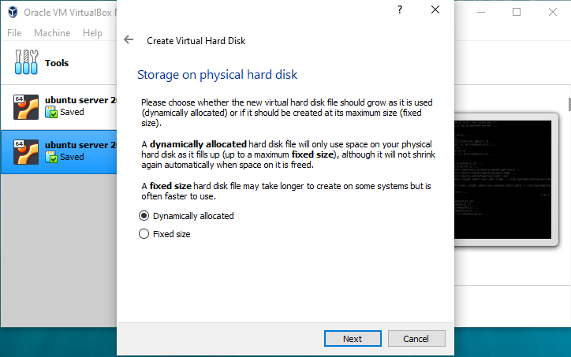
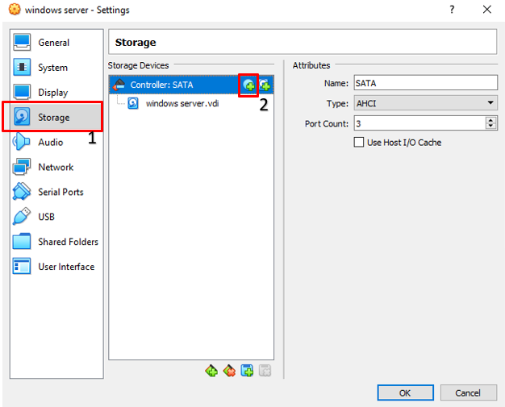
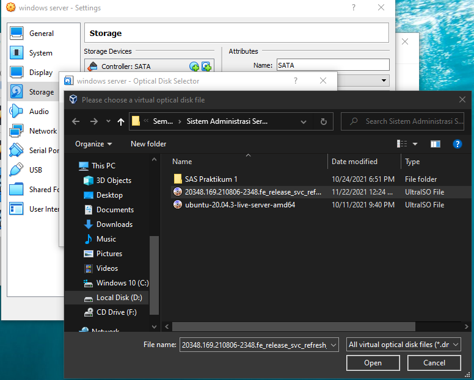
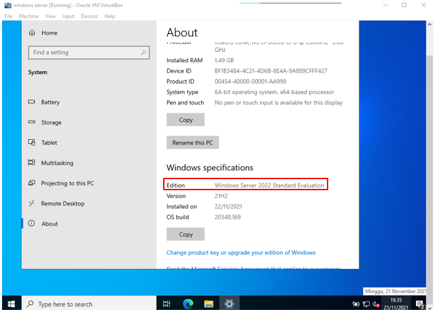

# Laporan UTS Instalasi Windows Server 2022

Pada kesempatan kali ini terdapat soal, yang menginstruksikan untuk melakukan instalasi windows server 2022 pada virtual machine.

Dari penjelasan soal diatas kita melakukan penginstalan windows server 2022 pada virtual machine. Soal UTS dapat diaskes [Disini.](https://yptorid-my.sharepoint.com/:w:/g/personal/aldo_ittelkom-sby_ac_id/EahwnD4AudVAqCDtSDN9JVsBTLMMU-hBAnMwq-2TthH9dA?e=gpexdw)

## Installation windows server 2022
---
### 1. Download file iso windows server 2022

- Open link berikut untuk mendownload file windows server 2022

    https://www.microsoft.com/en-us/evalcenter/evaluate-windows-server-2022
        
    - Download windows server 2022 file iso

        
    

### 2. Open virtualbox untuk langkah awal instalasi pada virtualbox

- Tampilan virtualbox awal

     
    
- Create new virtual machine untuk windows server 2022

    

- Beri nama untuk virtual machine tersebut

    

-  Setting aloksai RAM dan juga setting disk baik size maupun type yang digunakan pada virtual machine

    - Setting RAM

        
    
    - Create Disk
    
        
    
    - Setting Disk type
    
        

        
    
    - Setting location and size of Disk
    
        

- Hasil create virtual machine

    

)

### 3. Setting pada storage untuk select iso file windows server dan juga setting network 

- Open setting pada virtual machine yang telah dibuat

    

    - Setting storage iso

        

        

        

        

        

    - Setting network

        
    

### 4. Open virtual machine yang telah dibuat

- start virtual machine windows server 2022

    

- instalasi wizzard windows server 2022

    

- install windows server 2022

    

    - select windows server 2022 desktop experience  
            
        

    - setuju license terms
            
        

    - select windows server 2022 install microsoft server advanced
            
        

    - location installation of windows server 2022

         

    - installation progress

         

    - custom password administrator 

         
    
    - tampilan lock desktop dari windows server 2022

         

    - akses menu dengan input "ctrl + alt + delet" lalu masukkan password administrator yang telah dibuat

         

    -  windows server 2022 berhasil di install

         

## Installation Add-ons Windows Server 2022
- Rename nama computer untuk memudahkan

    - open windows powershell

        

    - rename nama computer menjadi Server 2022
        
---
### Installation Active Directory Domain Services
- open server manager

    
- buka manage lalu pilih add roles dan features

    

- klik next

    
- pilih role based installation
  
    
- pilih server from the server pool
  
    
- add fitur active directory domain service
  
    
---
### Installation DNS server
- add fitur dns
  
    
---
### Installation Net Framework 3.5
- add fitur Net Framework 3.5 yang include net 2.0 dan 3.0 dan group policy management
  
    
- next step
  
    
- next step
  
    
- Install add-ons yang sudah di tambahkan
  
    
- progress installation 
  
    
- result progress installation 
  
    

## Promote Server to a Domain Controller
---
### setting ip static melalui cmd
- open command promt (cmd)
  
    
- masukkan command SConfig
  
    
- pilih network setting
  
    
- pilih ip
  
    
- setting ip static dengan ip baru
  
    
- proses setting ip static berhasil
  
    
- open network setting
  
    
- ethernet lalu change adapter
  
    
- open properties dari ethernet
  
    
- input preferred dns sesuai dengan yang tadi tertera di cmd 
  
    
- open server manager  lihat notifikasi dan klik Promote Server to a Domain Controller
  
    
- create new forest dan masukkan nama domain yang kita inginkan
  
    
- pilih functional windows server 2016 dan juga checklist dns dan gc kemudian input password sesuai keinginan
  
    
- skip, next step
  
    
- input nama netbiosnya
  
    
- skip, next step
  
    
- check kembali apa sudah benar sesuai dengan apa yang diinginkan
  
    
- ketika All prerequisite checks passed successfully muncul lalu install
  
    
- installation progress
  
    
- login dengan password yang tadi dibuat
  
    
- check dengan "netdom query fsmo" saya berhasil melakukan Promote Server to a Domain Controller
  
    

terima kasih, sekian dari laporan yang di buat oleh
## Galih Dimas Prastowo  (1202190018)