# Laporan Praktikum System Administrasi 1
___
Pada parktikum kali ini terdapat soal dengan keadaan seperti gambar berikut.


Dari keadaan diatas kita melakukan perubahan pada soal latihan praktikum sesuai dengan soal praktikum yang telah di berikan. Soal praktikum dapat diaskes [Disini.](https://github.com/aldonesia/Sistem-Administrasi-Server-2021/blob/master/modul-1/soal_praktikum.md)

### 1. Mengubah nama container dari ubuntu_php5.6 menjadi ubuntu_landing dan menyesuaikan ip dengan kondisi terbaru
___

- rename ubuntu_php5.6 to ubuntu_landing

    - stop ubuntu yang akan diganti

        ```bash
        sudo lxc-stop -n ubuntu_php5.6
        ```
    - ubah nama container lalu start container

        ```bash
        sudo lxc-copy -R -n ubuntu_php5.6 -N ubuntu_landing
        sudo lxc-start -n ubuntu_landing
        ```
    - check list container
        ```bash
        sudo lxc-ls -f
        ```
        
- setting ip 10.0.3.103

     - masuk kedalam container dan buka network interfaces

        ```bash
        sudo lxc-attach -n ubuntu_landing
        nano /etc/network/interfaces
        ```
        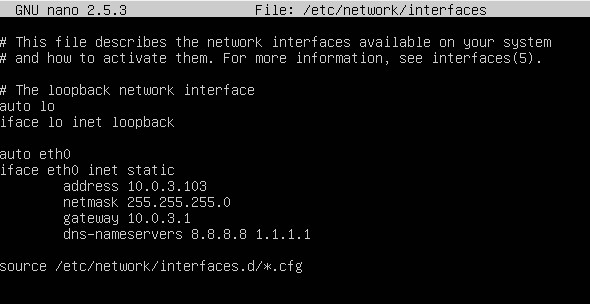
    - restart network

        ```bash
        systemctl restart networking.service
        ifconfig
        ```
        
    - keluar dari ubuntu landing agar dapat menjalankan soal selanjutnya

        ```bash
        exit
        ```

### 2. buat container lxc debian 9 dengan nama debian_php5.6 dan menyesuaikan ip dengan kondisi terbaru
___

- create container

     - create container debian 9 dan start container

        ```bash
        sudo lxc-create -n debian_php5.6 -t download -- --dist debian --release stretch --arch amd64 --force-cache --no-validate --server images.linuxcontainers.org
        sudo lxc-start -n debian_php5.6
        ```
    - check list container
        ```bash
        sudo lxc-ls -f
        ```
        
- install nginx dan nginx-extras 

    - install nginx dan nginx-extras di dalam container
        ```bash
        sudo apt install nginx nginx-extras
        ```

- setting ip 10.0.3.102

    - masuk kedalam container dan install net-tools curl serta buka network interfaces

        ```bash
        sudo lxc-attach -n debian_php5.6
        apt install nano net-tools curl
        nano /etc/network/interfaces
        ```
        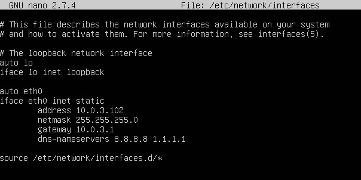
    - restart network cek ip

        ```bash
        systemctl restart networking.service
        ifconfig
        ```
        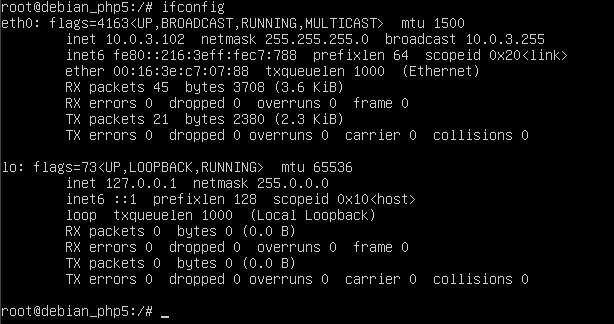

### 3. setting nginx debian_php5.6 dengan domain http://lxc_php5.dev dan buat keterangan lxc didalam nya
___

- setting nginx

    - masuk kedalam direktori sites available dan buat file  kosong dengan nama lxc_php5.6.dev

        ```bash
        cd /etc/nginx/sites-available
        touch lxc_php5.6.dev
        nano lxc_php5.6.dev 
        ```
        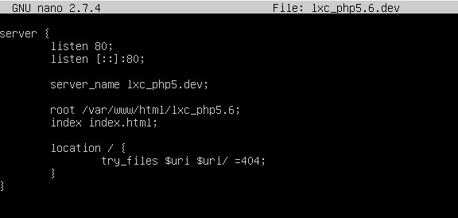
    - masuk kedalam direktori sites enable, membuat symbolic link file container dan melakukan test serta buka file direktori host

        ```bash
        cd ../sites-enabled
   	    ln -s /etc/nginx/sites-available/lxc_php5.6.dev .
   	    nginx -t
   	    nginx -s reload
   	    nano /etc/hosts
        ```
        
    - masuk kedalam direktori html, membuat direktori lxc_php5.6 dan mengcopy code dari nginx-debian.html to index.html serta buka file index html

        ```bash
        cd /var/www/html
        mkdir lxc_php5.6
        cp index.nginx-debian.html lxc_php5.6/index.html
        nano index.html
        ```
        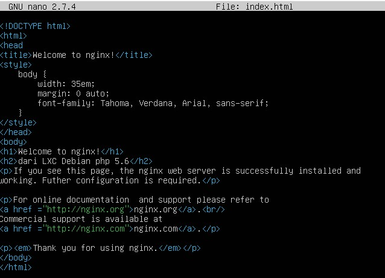
    - mengecek konektivitas ke URL

        ```bash
        curl -i http://lxc_php5.dev
        ```
    - keluar dari debian phap5.6 agar dapat menjalankan soal selanjutnya

        ```bash
        exit
        ```

### 4. setting nginx ubuntu_landing dengan domain http://lxc_landing.dev dan buat keterangan lxc didalam nya

- setting nginx

    - masuk kedalam container serta masuk ke dalam direktori sites available

        ```bash
        sudo lxc-attach -n ubuntu_landing
        cd /etc/nginx/sites-available
        ```
    - rename nama file dan ubah sedikit isinya

        ```bash
        mv lxc_php5.6.dev lxc_landing.dev
        nano lxc_landing.dev
        ```
        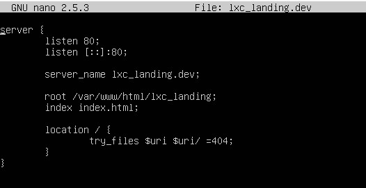
    - masuk ke dalam direktori sites enable, membuat symbolic link file container dan melakukan test serta buka file direktori host

        ```bash
        cd ../sites-enabled
   	    ln -s /etc/nginx/sites-available/lxc_landing.dev .
   	    nginx -t
   	    nginx -s reload
   	    nano /etc/hosts
        ```
        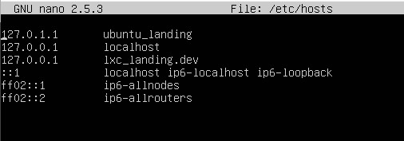
    - masuk ke dalam direktori var html dan ubah nama file lxc_php5.6 menjadi lxc_landing serta buka index html

        ```bash
        cd /var/www/html
        mv lxc_php5.6 lxc_landing
        nano index.html
        ```
        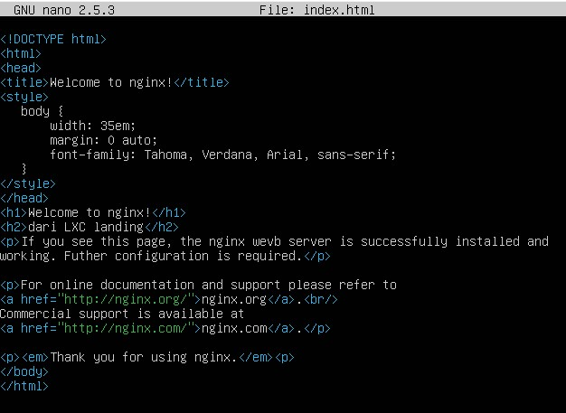
    - mengecek konektivitas ke URL

        ```bash
        curl -i http://lxc_php5.dev
        ```
    - keluar dari debian phap5.6 agar dapat menjalankan soal selanjutnya

        ```bash
        exit
        ```
### 5. setting ubuntu landing autostart ketika vm terbuka
- setting config container

    - stop ubuntu landing lalu setting config auto start dengan lxc.start.auto = 1

        ```bash
        sudo lxc-stop -n ubuntu landing
        echo "lxc.start.auto = 1" >> /var/lib/lxc/ubuntu_landing/config
        ```
    - check list container
        ```bash
        sudo lxc-ls -f
        ```
        
### 6. setting nginx pada vm sesuai soal 
- setting nginx 

    - setting nginx hosts

        ```bash
        sudo nano /etc/hosts
        ```
        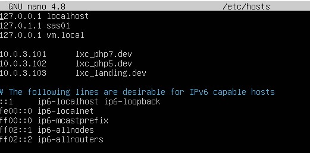
     - masuk ke dalam direktori sites available dan buka vm local

        ```bash
        cd /etc/nginx/sites-available
        sudo nano vm.local
        ```
        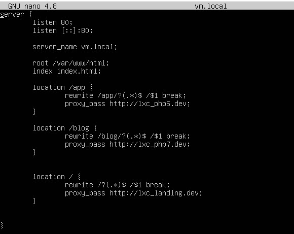
    - melakukan test serta mengecek konektivitas ke URL

        ```bash
        sudo nginx -t
        sudo nginx -s reload
        curl -i http://vm.local
        ```
### 7. pengujian pada web browser ketiga web
- hasil test web 
    - mengakses http://vm.local

        
    - mengakses http://vm.local/blog

        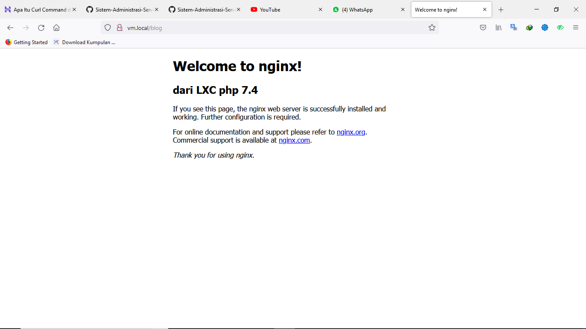
    - mengakses http://vm.local/app

        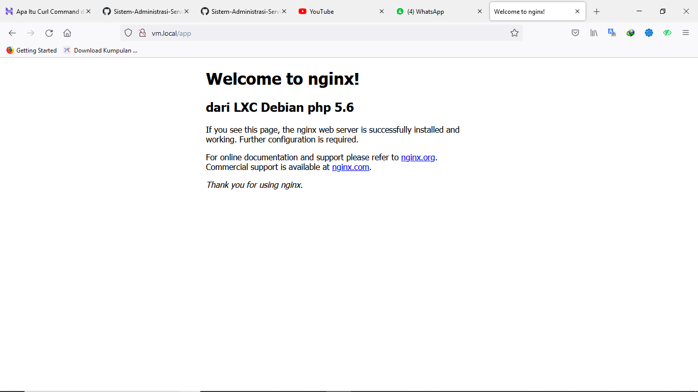
### 8. Analisa soal terakhir
- menjawab pertanyaan pada soal
    
    - In April 2021, Ubuntu 16.04 xenial will reach end of standart support and cant be used for php 5.6

    - Because the website schema used few different linux system. Therefore, using LXC virtualization make it easy to create servers 

    - a proxy server is a server application that acts as an intermediary between a client requesting a resource and the server providing that resource.
    From the case, vm.local as proxy server and web landing page. It's mean vm.localis a bridge to connect internet


terima kasih, sekian dari laporan yang di buat oleh
- Galih Dimas Prastowo  (1202190018)
- Muhammad Rafi Irzam   (1202190063)
